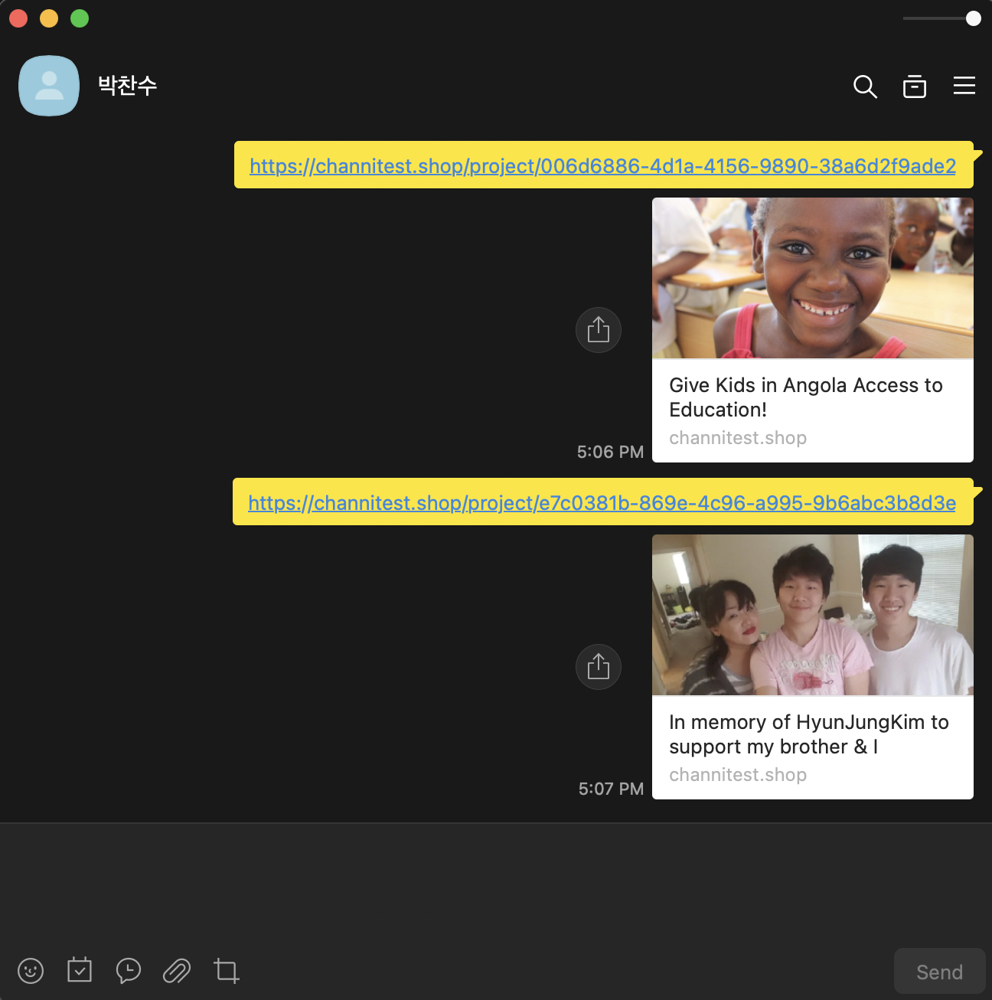

# GlobalTouch 프론트엔드 프로젝트 소개 🥳

- GlobalTouch는 지도 기반 기부 플랫폼입니다.
- 개인이나 단체가 프로젝트를 생성하고, 다른 사용자들이 해당 프로젝트에 기부할 수 있습니다. gofundme, global giving과 비슷하나 세계 지도 기반으로 사용자에게 어디에 어떤 프로젝트가 있는지 한눈에 볼 수 있습니다.
- 이 프로젝트는 GlobalTouch의 프론트엔드 부분을 담당하며 Next.js로 개발되었습니다.

## 시연 영상 🎥
#### Random Seeding 데이터가 들어간 상태로 시연한 영상입니다.
- [GlobalTouch 시연 영상](https://youtu.be/mIOkJpQ-3s8?si=yXXtemwNp4oN1KKW)
- 

## Figma 디자인 🎨
- [GlobalTouch Figma 디자인](https://www.figma.com/design/Ox761mMCN4pyo54zBv9rUG/globalTouch-beta?node-id=2273-12870&p=f&t=WiYBci88ts3nwuiQ-0)

## 프론트엔드 프로젝트 🌐
- [백엔드 프로젝트 깃헙 링크](https://github.com/pcs9898/globaltouch-backend)

## 제작 기간 📅 && 참여 인원 🧑‍🤝‍🧑
- 2023.10.15 ~ 2023.11.14 (약 4주)
- 1인 개발

## 주요 기능 ✨
- 회원가입 및 로그인 (이메일 로그인, 구글 로그인, jwt access token, refresh token)
- 지도 기반 프로젝트 마커 보여주기 (공간쿼리 사용)
- 기부 프로젝트 CRUD (여러 조건들로 커서 페이징)
- 기부 프로젝트 OG 구현
- 기부 (결제, 포트원(카카오페이 사용), 트랜잭션 적용)
- 기부 프로젝트 업데이트 CR (기부 받은 돈으로 어떻게 사용했는지 일기 같은 타임라인 개념)
- 기부 프로젝트 검색 기능 (커서 페이징, 카테고리 적용)
- 다국어(영어) 지원, 다크 모드 지원
- 다이나믹 OG 지원

## 기술 스택 🧑‍💻
- Next.js
- Apollo Client
- Recoil
- Chakra UI
- i18 Next
- Google Maps API

## 개발 순서 📝
#### 초기 세팅뒤 공통 컴포넌트 개발, 그 후 개별 페이지 개발했습니다.

- [x] feature0/initialSetup

#### Commons

- [x] feature1/molecules

- [x] feature2/organisms

- [x] feature3/layouts

- [x] feature4/templates

#### Pages

- [x] feature5/signUpPage

- [x] feature6/signInPage

- [x] feature7/homePage

- [x] feature8/createProjectPage

- [x] feature10/settingsPage

- [x] feature11/projectPage

- [x] feature12/createUpdatedProjectPage

- [x] feature13/projectUpdatesPage

- [x] feature14/donationPage

- [x] feature15/searchPage

- [x] feature16/mePage

- [x] feature17/editProfileModal

- [x] feature18/footerOrganisms

- [x] feature19/staticPages

## 프로젝트 간단 추가 설명 😄
- 아토믹 패턴을 적용하여 컴포넌트를 개발했습니다. Ui라이브러리로 Chakra UI를 사용중이라 atoms는 없습니다. 컨테이너, 프레젠터 패턴 적용을 위해 아토믹 패선에서 Pages를 컨테이너, templates를 프레젠터로 사용했습니다.
- 대부분의 컴포넌트는 가능한 모바일, 태블릿, 데스크탑 환경에서 동작하도록 반응형으로 개발했습니다.
- 댓글 작성, 기부 등등 성공 응답만 받으면 별도의 쿼리 없이 캐시를 업데이트하여 UI를 업데이트하는 방식으로 개발했습니다.
- 검색에는 디바운싱을 적용하여 사용자가 입력을 멈추면 검색을 하도록 했습니다.
- 초기 로딩 속도 개선을 위해 프로젝트 상세 페이지의 경우 SSR을 적용했습니다.
- SEO 개선을 위해 시멘틱 태그를 사용하고, OG 태그를 동적으로 생성하여 프로젝트 페이지마다 고유한 메타 정보를 제공했습니다.
- 스켈레톤을 적용하여 Reflow(CRP 최적화)를 방지하였습니다.
- 댓글은 optimistic ui를 적용하여 즉각적인 사용자 피드백을 제공했습니다.
- 이미지 첨부 시 미리보기 속도 개선을 위해 임시 URL을 적용하였습니다.
- 여러가지 Custom Hook을 만들어서 사용했습니다.

## 프로젝트 회고 🤔
- 언어 변경시 단순히 화폐문양만 바뀌도록 했는데 실시간으로 환율 가져와서 반영해보면 좋을 것 같습니다.
- Chakra UI는 Tree Shaking에 문제가 있어 앞으로는 Tailwind CSS를 사용할 예정입니다.
- 처음엔 지도를 React Simple Maps를 사용하려 했으나 한계가 있어 Google Maps API를 사용하였습니다, Google maps api에 많은 커스터마이징을 해 덕분에 많이 배웠습니다.
- 결제도 처음 구현해보는데 포트원을 이용해서 쉽게 구현했지만 모바일, pc가 다른 등 많이 배웠습니다.
- FE의 경우 정말 많은 최적화가 남아 있어 usememo, usecallback 같은 것 부터 시작해서 이미지 로딩, 코드 스플리팅, 정적 페이지 클라우드에 분리배포 등 더 많은 공부를 해야되겠다고 느꼈습니다.